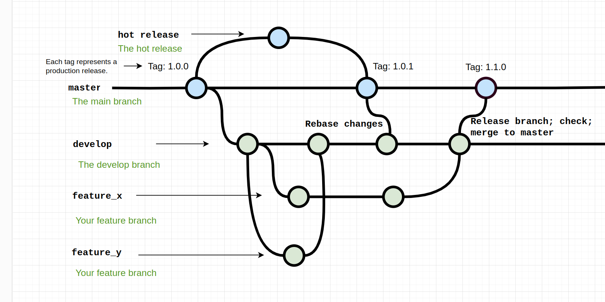

# Contributing to [on-premise-helm-charts](https://github.com/2gis/on-premise-helm-charts/tree/master)

Thank you for your interest in contributing to our Helm charts repository. We welcome contributions from the community and appreciate your help in improving our charts.

Before you start, please take a moment to review the following guidelines to ensure a smooth and productive contribution process.

## Table of Contents

- [How to Contribute](#how-to-contribute)
  - [Contribution Guidelines](#contribution-guidelines)
- [Requirements for the design of PR](#requirements-for-the-design-of-pr)
- [Gitflow](#gitflow)
  - [Basic guidelines](#basic-guidelines)
  - [Urgent bugfix guidelines](#urgent-bugfix-guidelines)

## How to Contribute

- We are open to getting contributions from other people. Please note that DCO is not required.

- We are only interested in accepting contributions that improve the quality of our software. Please make sure that your contributions are well-tested and documented.

### Contribution Guidelines

- Create a new branch for your changes. Choose a descriptive branch name.
- Make your changes, ensuring they follow our Style Guide (see [Style Guide](styleguide.md)).
- Make your changes and commit them with clear, concise messages to your branch.
- Test your changes locally to verify they work as expected.
- Create a pull request (PR) to the `develop` branch.
- Provide a clear and detailed description of your changes in the PR (see [Requirements for the design of PR](#requirements-for-the-design-of-pr)).
- Be responsive to any feedback or questions on your PR.

Once your PR is approved, it will be merged. Thank you for your contribution!

## Requirements for the design of PR

- New appVersion (or tag) specified
- The title of the PR begins with the services name, the addition feature/bugfix is welcome, and the short description of the feature follows. Good examples of PR names:
  > LICENSE Feature: add super license;
  
  > [tiles-api] Upgraded version and added breaking changes
  
  > navi-back: upstream sync
- The PRs description clearly explains the feature and how to check it.
Good example of the description:

  > A values.yml file contains a new value, value1. The purpose of this is as follows. Value1 could have "a" or "b" values. One may verify this new feature by utilizing the curl command ('curl example')

## Gitflow

This project uses the Gitflow branching model.

### Basic Guidelines

- The main branch is `master`.
- All development should happen on feature branches.
- Feature branches should be named with a descriptive name.
- Once a feature branch is complete, it should be merged into the `develop` branch with a pull request.
- The maintainers team will review PRs once a week (on Mondays).
- The PR will be reviewed if:
  - it is not in Draft
  - it is not in WIP
- In the event of questions about a PR, the need for improvements, the lack of an image provided to us, etc., we start a discussion. The next time this PR will be reviewed the following week (i.e., the team has a week to fix, improve, push, etc.). This way, everything will be predictable and work can be planned.
- After the PR is reviewed, it is merged into develop.
- If it is necessary to create a branch for a task, teams branch off from develop (this is where the latest changes will be).
- When preparing for a release, nothing additional will be taken except for what has already been reviewed and merged into develop. We check all deployments and the operation from the develop branch. If everything is OK, we take it to master, set the tag of the new release with the minor bump.

### Urgent bugfix Guidelines

If it is necessary to release an urgent bug fix without going through the develop branch:

- Create a branch from master.
- Make the fix.
- Create a PR to master.
- The maintainers team checks the fix and all deployments (as in a standard release).
- Merge the branch into master, set the tag of the new release with a bugfix bump.
- Move this commit to develop

